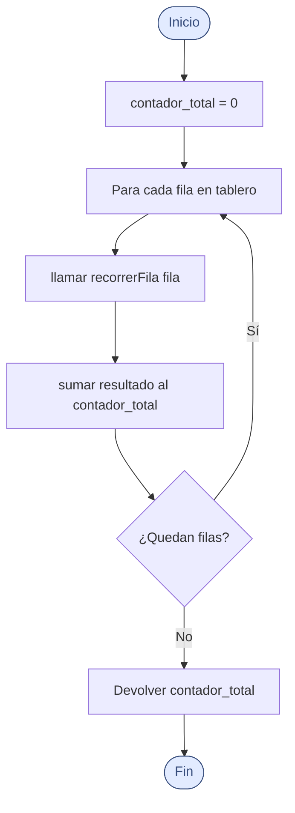
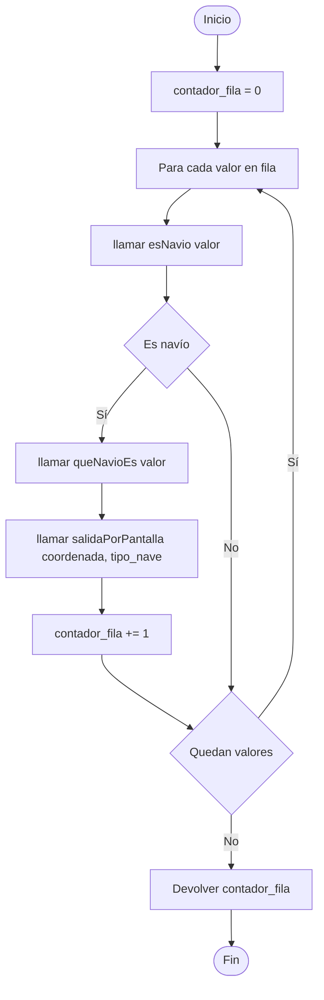

# Hundir la flota

#### Aquí voy a realizar un juego de hundir la flota

---

## `Diagrama de flujo` 
### - Tablero

```mermaid
flowchart TD
    A(["Inicio"]) --> B["contador_total = 0"]
    B --> C["Para cada fila en tablero"]
    C --> D["llamar recorrerFila fila"]
    D --> E["sumar resultado al contador_total"]
    E --> F{"¿Quedan filas?"}
    F -- Sí --> C
    F -- No --> G["Devolver contador_total"]
    G --> H(["Fin"])
     A:::Sky
     H:::Sky
    classDef Sky stroke-width:1px, stroke-dasharray:none, stroke:#374D7C, fill:#E2EBFF, color:#374D7C
```

### - Fila

```mermaid
flowchart TD
    A(["Inicio"]) --> B["contador_fila = 0"]
    B --> C["Para cada valor en fila"]
    C --> D["llamar esNavio valor"]
    D --> E{"Es navío"}
    E -- Sí --> F["llamar queNavioEs valor"]
    F --> G["llamar salidaPorPantalla coordenada, tipo_nave"]
    G --> H["contador_fila += 1"]
    H --> I{"Quedan valores"}
    E -- No --> I
    I -- Sí --> C
    I -- No --> J["Devolver contador_fila"]
    J --> K(["Fin"])
```